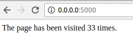

## Page Visit Counter



Count how many times the page is visited and store in `redis`.

### Docker Instruction:
Prerequisites:
* `Docker`
* `Docker Compose`

#### Run project using `Docker` for First Time:

* In `page-visit-counter` directory:
  To builds, (re)creates, starts, and attaches to containers for a service.
    ```
    docker-compose up -d
    ```
  To stop: 
    ```
    docker-compose stop
    ```
    
* URL:
    * Web app: [http://0.0.0.0:5000/](http://0.0.0.0:5000/)

